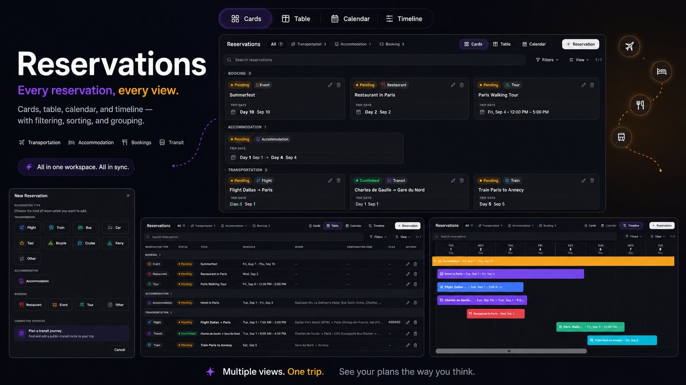

# Reservations

Combined reservation views for TREK trip pages.

## Screenshots



## What it does

This trip-page plugin reads the active trip's reservation rows through the TREK
plugin API and displays transportation and booking reservations together. It
keeps the core split from TREK's built-in reservations panel:

- transportation: flights, trains, buses, cars, taxis, bicycles, cruises,
  ferries, transit, and other transport
- bookings: hotels, restaurants, events, tours, and other reservations

The current version is read-only. It includes status filtering, type filters,
date/type/title/status sorting, card view, and a compact table view.

## Planned Enhanced Version

- sortable reservation table columns
- richer tabular views
- enhanced filtering
- table quick edit after TREK exposes reservation write APIs to plugins

## Permissions

| Permission      | Why                                                                            |
| --------------- | ------------------------------------------------------------------------------ |
| `db:read:trips` | Read the active trip, places, and reservation rows for the authenticated user. |
| `db:read:files` | Read filenames for files linked to reservations in the active trip.            |

## Setup

Install dependencies and start the client builder plus SDK dev server:

```bash
npm install
npm run dev
```

Open the SDK preview and select a trip-page context. TREK provides `tripId` to
the plugin iframe, and the iframe calls the plugin's authenticated
`/reservations` route.

The repository includes a synthetic `dev-fixtures.json` for the SDK preview's
trip `42`. It contains example-only data and is never included in `plugin.zip`.

For a release, run `npm run validate` and `npm run pack`. The generated
`build/` directory is the clean plugin root consumed by the TREK SDK and can be
used for a local TREK dev-link.

## License

MIT
